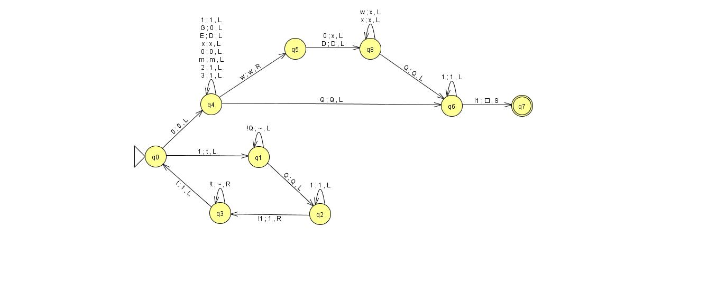
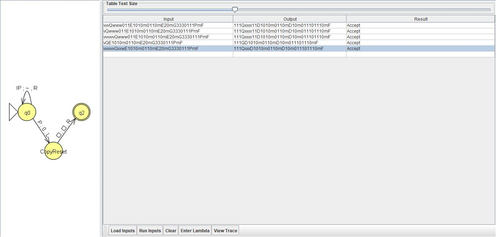

This is the original overwrite state and success sweep combined.  

Test_CopyReset test data:  

vvvQwww011E1010m0110mE20mG3330111PmF	111Qxxxx11D1010m0110mD10m011101110mF	Accept  
vQwww011E1010m0110mE20mG3330111PmF	111Qxxxx11D1010m0110mD10m011101110mF	Accept  
vvvvvvQwww011E1010m0110mE20mG3330111PmF	111Qxxxx11D1010m0110mD10m011101110mF	Accept  
vQE1010m0110mE20mG3330111PmF	111QD1010m0110mD10m011101110mF	Accept  
vvvvvvQxxwE1010m0110mE20mG3330111PmF	111QxxxD1010m0110mD10m011101110mF	Accept  