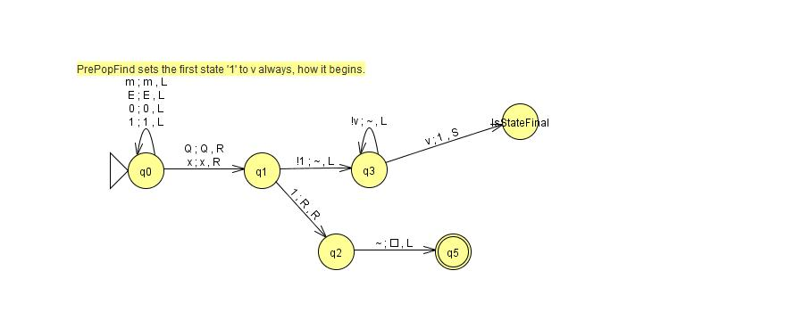

jflap question: I seem to only be able to egt jflap to show the full transduced output if it stops in an accepting state
in the main TM scope. So I put that (~,~,S) at the end of Test_GotF.

### GotF:

### IsStateFinal:

### Test_GotF:
![] (Test_GotF.jpg)

Test_GotF multi-run (Transducer) data:

111QxxxE10m011m0mF111B	A	Accept  

111Qxxx1E10m011m0mF111B	R	Accept  

111Q1E10m011m0mF111B	R	Accept  

111QE10m011m0mF111B	A	Accept  
