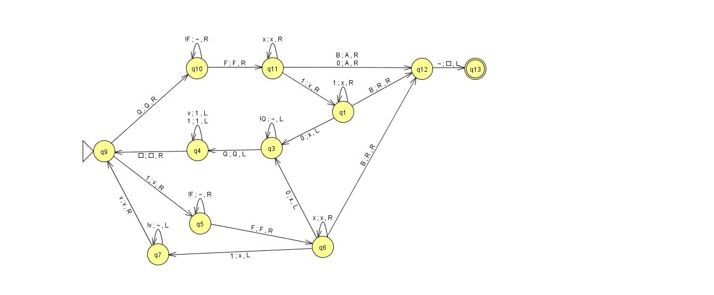

# DPDA Simulator
 
Implementation of a standard Turing Machine that simulates a Deterministic 
Pushdown Automata on an input string.
 

The following is an example that checks to see
if a run of ones bounded by #...Q
is in a final set to the right that may look like F111011B

