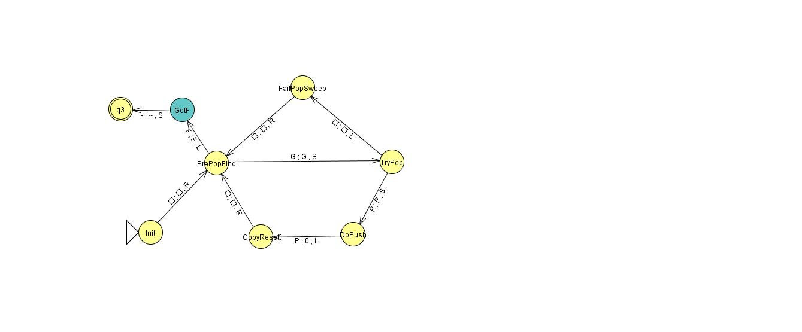

# DPDA Simulator
 
Implementation of a standard Turing Machine that simulates a Deterministic 
Pushdown Automata on an input string.
 

The following is an example that checks to see
if a run of ones bounded by #...Q
is in a final set to the right that may look like F111011B

What main looks like, some of the handoff conventions are inconsistent, idk which is best and most of it is written already:  

WE HAVE LIFT OFF (kinda, see notes at end of test data for how celebrity DPDA fails when has to go FailPop route)  

